# Library Management System (LMS)

**Phase 2 Capstone Project — Full-Stack Web Application with ETL Analytics Pipeline**

---

## Project Overview

A web-based **Library Management System** that digitizes library operations and delivers data-driven analytics through a complete ETL pipeline. Phase 2 extends Phase 1 with Pandas-based ETL workflows, five analytics API endpoints, and an interactive Analytics Dashboard with charts.

### Phase 2 Key Highlights
- ETL pipeline: Extract (CSV) → Transform (Pandas) → Load (SQLite analytics tables)
- 162-record transaction dataset spanning 22 months across 50 books and 50 borrowers
- Analytics: Most borrowed books, category-wise borrowing, monthly trends, overdue analysis
- 7 new REST API endpoints (analytics + ETL trigger/logs)
- Interactive Analytics Dashboard with bar, pie, and line charts (Recharts)

### Phase 1 Key Highlights
- Complete CRUD operations for Books and Borrowers
- Borrow and Return workflow with automatic availability tracking
- Real-time Dashboard with live statistics
- Keyword-based Search with availability filtering
- 19 REST API endpoints documented via Swagger UI

---

## ETL Workflow

```
datasets/
├── books.csv         (51 rows — 50 unique books + 1 duplicate for transform test)
├── borrowers.csv     (51 rows — 50 unique borrowers + 1 duplicate + missing phones)
└── transactions.csv  (162 rows — Jan 2024 to Oct 2025, 17 overdue records)

ETL Pipeline  (backend/etl/)
     │
     ▼
┌─────────────┐
│   EXTRACT   │  extract.py  — read CSVs into pandas DataFrames
└──────┬──────┘
       │
       ▼
┌─────────────┐
│  TRANSFORM  │  transform.py — drop duplicates, fill missing values,
└──────┬──────┘               validate types, normalise dates
       │
       ▼
┌─────────────┐
│    LOAD     │  load.py — upsert books/borrowers/transactions,
└──────┬──────┘           then rebuild 4 analytics tables:
       │                    • popular_books_report
       │                    • category_borrowing_stats
       │                    • monthly_borrowing_trends
       │                    • overdue_analytics
       ▼
  SQLite DB + ETL run logged to etl_run_logs
```

### Transform Rules Applied
| Entity | Issue | Fix |
|--------|-------|-----|
| Books | Missing `category` | Fill with `"General"` |
| Books | Missing `isbn` | Generate `"ISBN-{book_id}"` |
| Books | Duplicate ISBN | Keep first, drop rest |
| Borrowers | Missing `phone` | Fill with `"N/A"` |
| Borrowers | Duplicate email | Keep first, drop rest |
| Transactions | Missing `due_date` | Compute as `borrow_date + 14 days` |
| Transactions | Invalid `borrow_date` | Drop row |

### Running the ETL Pipeline
```bash
# Option 1 — via API (recommended)
curl -X POST http://localhost:8000/etl/run

# Option 2 — directly from terminal
cd backend
python -m etl.pipeline
```

---

## Analytics Features

| Feature | Endpoint | Description |
|---------|----------|-------------|
| Most Borrowed Books | `GET /analytics/popular-books?limit=10` | Ranked list with borrow counts |
| Category Stats | `GET /analytics/category-stats` | Borrowings, unique borrowers, avg loan days per category |
| Monthly Trends | `GET /analytics/monthly-trends?year=2024` | Borrowings and returns per month |
| Overdue Analysis | `GET /analytics/overdue` | All unreturned past-due transactions with days overdue |
| Summary Card | `GET /analytics/summary` | High-level KPIs |
| ETL Trigger | `POST /etl/run` | Run the full pipeline |
| ETL Logs | `GET /etl/logs` | History of all ETL runs |

---

## Features Implemented

**Book Management**
- Add, view, edit, and delete books
- Track availability status (Available / Borrowed)
- ISBN uniqueness validation

**Borrower Management**
- Register borrowers with name, email, and phone
- Update and delete borrower records
- Email format validation

**Borrow / Return Transactions**
- Borrow an available book — auto-stamps borrow date, marks book as Borrowed
- Return a book — auto-stamps return date, marks book as Available
- Full transaction history with Book Title and Borrower Name

**Search Functionality**
- Keyword search across title, author, category, and ISBN
- Filter results by availability (All / Available / Borrowed)

**Dashboard**
- Live stats: Total Books, Available, Borrowed, Total Borrowers, Transactions, Active Loans
- Recent 5 transactions table

**Analytics Dashboard (Phase 2)**
- Summary KPI cards
- Top 10 Most Borrowed Books — horizontal bar chart
- Category-wise Borrowing Distribution — pie chart
- Monthly Borrowing Trends — multi-line chart with year filter
- Category Borrowing Statistics — sortable table
- Overdue Transactions — highlighted table with days-overdue badges
- ETL Pipeline status bar and one-click Run button

---

## Technology Stack

| Layer | Technology | Version |
|-------|-----------|---------|
| Frontend | React | 18.2.0 |
| Charts | Recharts | 2.12.7 |
| HTTP Client | Axios | 1.6.8 |
| Backend | FastAPI | 0.111.0 |
| Server | Uvicorn | 0.29.0 |
| ORM | SQLAlchemy | 2.0.30 |
| Validation | Pydantic | 2.7.1 |
| ETL | Pandas | 2.2.2 |
| Excel support | openpyxl | 3.1.2 |
| Database | SQLite | — |
| Language | Python | 3.8+ |
| Runtime | Node.js | 14+ |

---

## Project Structure

```
project-root/
│
├── datasets/                         ← Phase 2: CSV input files for ETL
│   ├── books.csv                     (51 rows — 50 unique + 1 duplicate)
│   ├── borrowers.csv                 (51 rows — 50 unique + 1 duplicate)
│   └── transactions.csv              (162 rows — Jan 2024 to Oct 2025)
│
├── frontend/
│   ├── public/
│   │   └── index.html
│   └── src/
│       ├── components/
│       │   └── Sidebar.jsx
│       ├── pages/
│       │   ├── Dashboard.jsx
│       │   ├── Books.jsx
│       │   ├── Borrowers.jsx
│       │   ├── Transactions.jsx
│       │   ├── Search.jsx
│       │   └── Analytics.jsx         ← Phase 2: ETL analytics dashboard
│       ├── services/
│       │   └── api.js                (includes analyticsAPI and etlAPI)
│       ├── App.js
│       ├── App.css
│       └── index.js
│
├── backend/
│   ├── main.py
│   ├── database.py
│   ├── models.py                     (Phase 2 analytics models included)
│   ├── schemas.py
│   ├── crud.py
│   ├── routers/
│   │   ├── __init__.py
│   │   ├── books.py
│   │   ├── borrowers.py
│   │   ├── transactions.py
│   │   ├── analytics.py              ← Phase 2: analytics endpoints
│   │   └── etl_routes.py             ← Phase 2: ETL trigger/log endpoints
│   ├── etl/                          ← Phase 2: ETL pipeline modules
│   │   ├── __init__.py
│   │   ├── extract.py                (reads CSVs into DataFrames)
│   │   ├── transform.py              (clean, deduplicate, validate)
│   │   ├── load.py                   (upsert DB + rebuild analytics tables)
│   │   └── pipeline.py               (orchestrator: Extract→Transform→Load)
│   ├── services/
│   │   └── __init__.py
│   └── requirements.txt
│
├── database/
│   └── schema.sql
│
├── docs/
│   ├── API_Documentation.md
│   └── Installation_Guide.md
│
├── screenshots/
│   ├── 01_dashboard.png
│   ├── 02_books_list.png
│   ├── 03_books_add_form.png
│   ├── 04_borrowers.png
│   ├── 05_transactions_borrow.png
│   ├── 06_transactions_return.png
│   ├── 07_transactions_history.png
│   ├── 08_search_results.png
│   ├── 09_swagger_ui.png
│   ├── 10_api_books_endpoint.png
│   ├── 11_api_dashboard_json.png
│   ├── 12_api_health_json.png
│   ├── 13_analytics_dashboard.png    ← Phase 2
│   ├── 14_popular_books_chart.png    ← Phase 2
│   ├── 15_category_pie_chart.png     ← Phase 2
│   ├── 16_monthly_trends_chart.png   ← Phase 2
│   ├── 17_overdue_table.png          ← Phase 2
│   └── 18_etl_pipeline_run.png       ← Phase 2
│
├── README.md
├── requirements.txt
└── .gitignore
```

---

## Setup Instructions

### Prerequisites

| Tool | Version | Download |
|------|---------|----------|
| Python | 3.8+ | https://python.org |
| Node.js | 14+ | https://nodejs.org |
| Git | Any | https://git-scm.com |

Verify installations:
```bash
python --version
node --version
npm --version
```

---

### Backend Setup

```bash
# 1. Navigate to the backend folder
cd backend

# 2. Create a virtual environment
python -m venv venv

# 3. Activate the virtual environment
# Windows (PowerShell)
.\venv\Scripts\Activate.ps1

# macOS / Linux
source venv/bin/activate

# 4. Install dependencies
pip install -r requirements.txt

# 5. Start the backend server
uvicorn main:app --reload --port 8000
```

Backend is ready at: `http://localhost:8000`  
Swagger API Docs: `http://localhost:8000/docs`  
ReDoc: `http://localhost:8000/redoc`

---

### Frontend Setup

Open a **new terminal** window:

```bash
# 1. Navigate to the frontend folder
cd frontend

# 2. Install dependencies
npm install

# 3. Start the development server
npm start
```

Frontend is ready at: `http://localhost:3000`

---

### Database Setup

The SQLite database (`library.db`) is **auto-created** on the first backend startup. No manual steps needed.

To manually seed the database using the included schema:

```bash
# From the project root
sqlite3 backend/library.db < database/schema.sql
```

To reset the database:
```bash
# Delete and restart backend — it will recreate automatically
rm backend/library.db
uvicorn main:app --reload --port 8000
```

---

## API Details

**Base URL**: `http://localhost:8000`  
**Format**: JSON  
**Interactive Docs**: `http://localhost:8000/docs`

---

### Books Management

| Method | Endpoint | Description |
|--------|----------|-------------|
| GET | `/books/` | Get all books |
| GET | `/books/{book_id}` | Get book by ID |
| POST | `/books/` | Add new book |
| PUT | `/books/{book_id}` | Update book |
| DELETE | `/books/{book_id}` | Delete book |

**POST /books/ — Request**
```json
{
  "title": "Clean Code",
  "author": "Robert C. Martin",
  "category": "Programming",
  "isbn": "9780132350884",
  "availability_status": "available"
}
```

**POST /books/ — Response (201)**
```json
{
  "book_id": 1,
  "title": "Clean Code",
  "author": "Robert C. Martin",
  "category": "Programming",
  "isbn": "9780132350884",
  "availability_status": "available"
}
```

**Error Response (400)**
```json
{
  "detail": "ISBN already exists in the system"
}
```

---

### Borrowers Management

| Method | Endpoint | Description |
|--------|----------|-------------|
| GET | `/borrowers/` | Get all borrowers |
| GET | `/borrowers/{borrower_id}` | Get borrower by ID |
| POST | `/borrowers/` | Register new borrower |
| PUT | `/borrowers/{borrower_id}` | Update borrower |
| DELETE | `/borrowers/{borrower_id}` | Delete borrower |

**POST /borrowers/ — Request**
```json
{
  "borrower_name": "Rahul Sharma",
  "email": "rahul@example.com",
  "phone": "9876543210"
}
```

**POST /borrowers/ — Response (201)**
```json
{
  "borrower_id": 1,
  "borrower_name": "Rahul Sharma",
  "email": "rahul@example.com",
  "phone": "9876543210"
}
```

---

### Transactions

| Method | Endpoint | Description |
|--------|----------|-------------|
| POST | `/borrow` | Borrow a book |
| POST | `/return` | Return a book |
| GET | `/transactions` | Get all transactions |

**POST /borrow — Request**
```json
{
  "book_id": 1,
  "borrower_id": 1
}
```

**POST /borrow — Response (201)**
```json
{
  "transaction_id": 1,
  "book_id": 1,
  "borrower_id": 1,
  "borrow_date": "2026-05-16T14:52:36.023618",
  "return_date": null,
  "book": {
    "book_id": 1,
    "title": "Clean Code",
    "availability_status": "borrowed"
  },
  "borrower": {
    "borrower_id": 1,
    "borrower_name": "Rahul Sharma"
  }
}
```

**POST /return — Request**
```json
{
  "book_id": 1,
  "borrower_id": 1
}
```

**POST /return — Response (200)**
```json
{
  "transaction_id": 1,
  "book_id": 1,
  "borrower_id": 1,
  "borrow_date": "2026-05-16T14:52:36.023618",
  "return_date": "2026-05-17T10:00:00.000000"
}
```

---

### Search & Dashboard

| Method | Endpoint | Description |
|--------|----------|-------------|
| GET | `/search?q={keyword}` | Search books by keyword |
| GET | `/dashboard` | Get library statistics |
| GET | `/health` | API health check |

**GET /search?q=python — Response (200)**
```json
[
  {
    "book_id": 2,
    "title": "Python Crash Course",
    "author": "Eric Matthes",
    "category": "Programming",
    "isbn": "9781593279288",
    "availability_status": "available"
  }
]
```

**GET /dashboard — Response (200)**
```json
{
  "timestamp": "2026-05-16T15:28:14.124657",
  "total_books": 8,
  "available_books": 7,
  "borrowed_books": 1,
  "total_borrowers": 6,
  "total_transactions": 1,
  "active_transactions": 1,
  "recent_transactions": [
    {
      "transaction_id": 1,
      "book_title": "Clean Code",
      "borrower_name": "Rahul Sharma",
      "borrow_date": "2026-05-16T14:52:36.023618",
      "return_date": null,
      "status": "active"
    }
  ]
}
```

**GET /health — Response (200)**
```json
{
  "status": "healthy",
  "timestamp": "2026-05-16T15:28:15.579958"
}
```

---

## Database Schema

### Phase 1 — Core Tables

#### books
| Column | Type | Constraints |
|--------|------|-------------|
| book_id | INTEGER | PRIMARY KEY, AUTO INCREMENT |
| title | TEXT | NOT NULL |
| author | TEXT | NOT NULL |
| category | TEXT | NOT NULL |
| isbn | TEXT | UNIQUE, NOT NULL |
| availability_status | TEXT | DEFAULT 'available' |

#### borrowers
| Column | Type | Constraints |
|--------|------|-------------|
| borrower_id | INTEGER | PRIMARY KEY, AUTO INCREMENT |
| borrower_name | TEXT | NOT NULL |
| email | TEXT | UNIQUE, NOT NULL |
| phone | TEXT | NOT NULL |

#### transactions
| Column | Type | Constraints |
|--------|------|-------------|
| transaction_id | INTEGER | PRIMARY KEY, AUTO INCREMENT |
| book_id | INTEGER | FOREIGN KEY → books.book_id |
| borrower_id | INTEGER | FOREIGN KEY → borrowers.borrower_id |
| borrow_date | DATETIME | DEFAULT CURRENT_TIMESTAMP |
| due_date | DATETIME | NULL |
| return_date | DATETIME | NULL (until returned) |

---

### Phase 2 — Analytics Tables (populated by ETL pipeline)

#### popular_books_report
| Column | Type | Description |
|--------|------|-------------|
| id | INTEGER | PRIMARY KEY |
| book_id | INTEGER | Reference to books table |
| title | TEXT | Book title |
| author | TEXT | Book author |
| category | TEXT | Book category |
| total_borrows | INTEGER | Total times borrowed |
| created_at | DATETIME | Last ETL rebuild timestamp |

#### category_borrowing_stats
| Column | Type | Description |
|--------|------|-------------|
| id | INTEGER | PRIMARY KEY |
| category | TEXT | Book category name |
| total_borrowings | INTEGER | Total borrow events |
| unique_borrowers | INTEGER | Distinct borrowers |
| avg_loan_days | FLOAT | Average loan duration in days |
| created_at | DATETIME | Last ETL rebuild timestamp |

#### monthly_borrowing_trends
| Column | Type | Description |
|--------|------|-------------|
| id | INTEGER | PRIMARY KEY |
| year | INTEGER | Calendar year |
| month | INTEGER | Calendar month (1–12) |
| month_name | TEXT | Abbreviated month name (Jan, Feb…) |
| total_borrowings | INTEGER | Borrow events in that month |
| total_returns | INTEGER | Return events in that month |
| active_loans | INTEGER | Net outstanding loans |
| created_at | DATETIME | Last ETL rebuild timestamp |

#### overdue_analytics
| Column | Type | Description |
|--------|------|-------------|
| id | INTEGER | PRIMARY KEY |
| transaction_id | INTEGER | Source transaction |
| book_id | INTEGER | Overdue book |
| book_title | TEXT | Book title |
| borrower_id | INTEGER | Responsible borrower |
| borrower_name | TEXT | Borrower full name |
| borrow_date | DATETIME | Date borrowed |
| due_date | DATETIME | Date due |
| days_overdue | INTEGER | Days past due date |
| status | TEXT | Always 'overdue' |
| created_at | DATETIME | Last ETL rebuild timestamp |

#### etl_run_logs
| Column | Type | Description |
|--------|------|-------------|
| id | INTEGER | PRIMARY KEY |
| run_at | DATETIME | Pipeline start time |
| records_extracted | INTEGER | Raw records read from CSVs |
| records_transformed | INTEGER | Records after cleaning |
| records_loaded | INTEGER | Records written to DB |
| status | TEXT | pending / running / success / failed |
| error_message | TEXT | Error detail (if failed) |
| duration_seconds | FLOAT | Total pipeline duration |

---

## Screenshots

### Dashboard
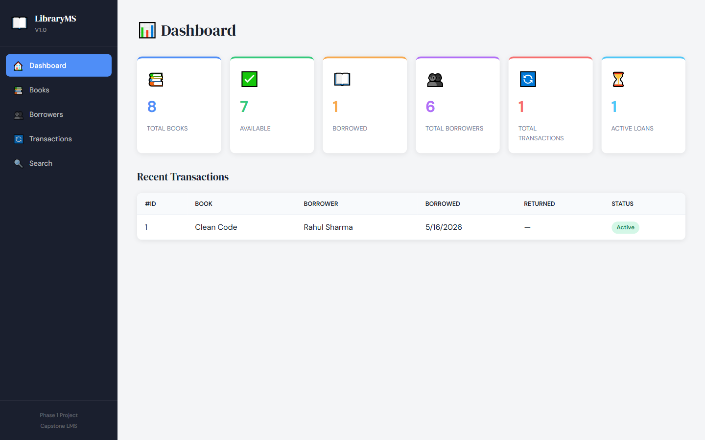

---

### Book Management — Listing Page
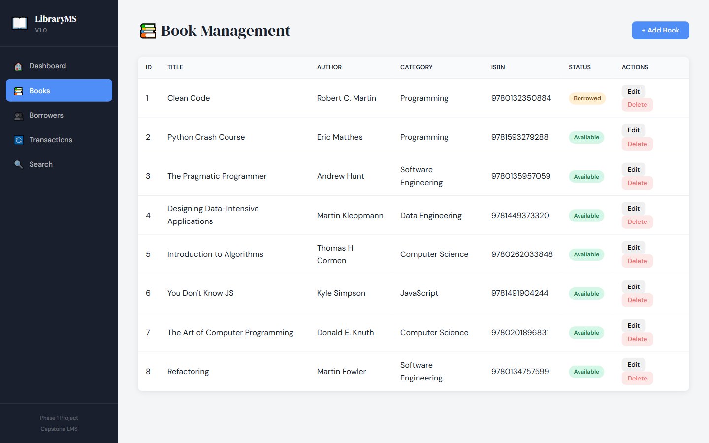

---

### Book Management — Add Book Form
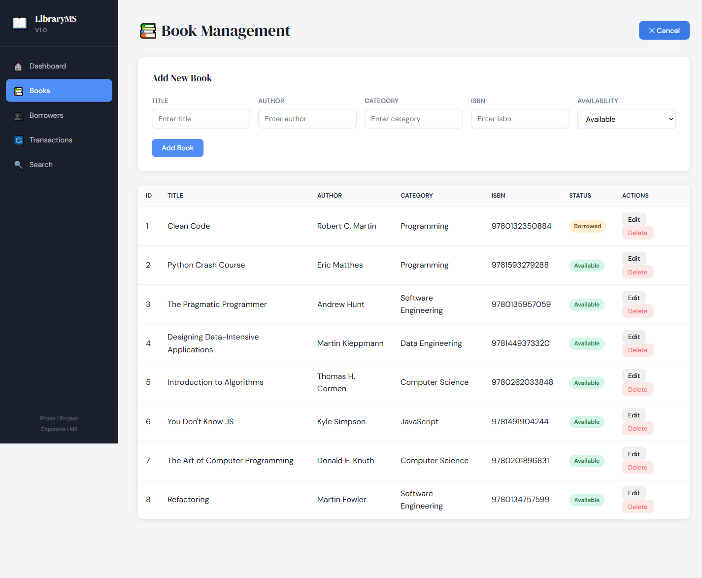

---

### Borrower Management — Listing Page
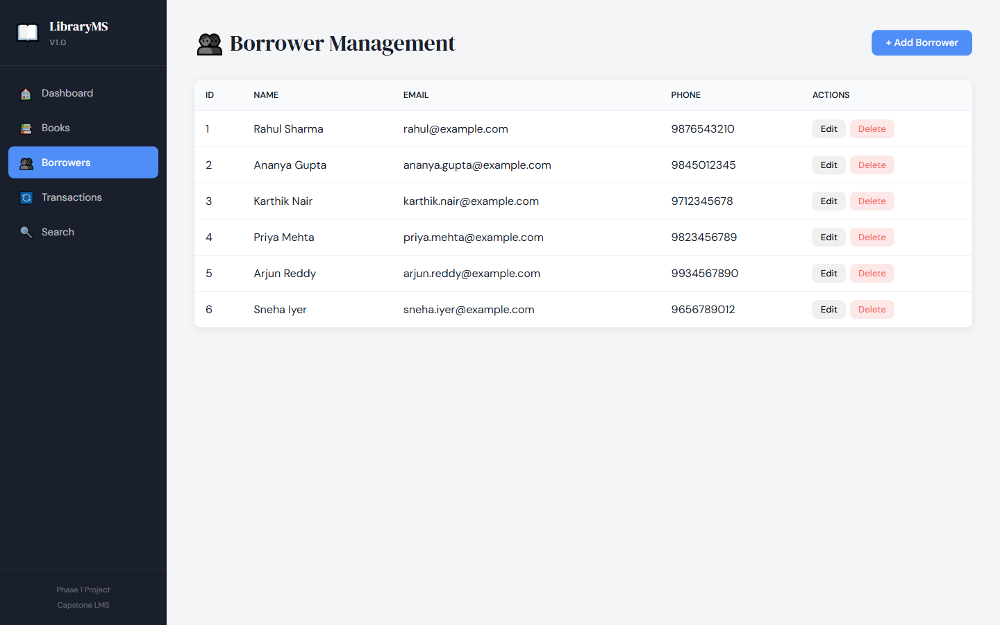

---

### Transactions — Borrow Book
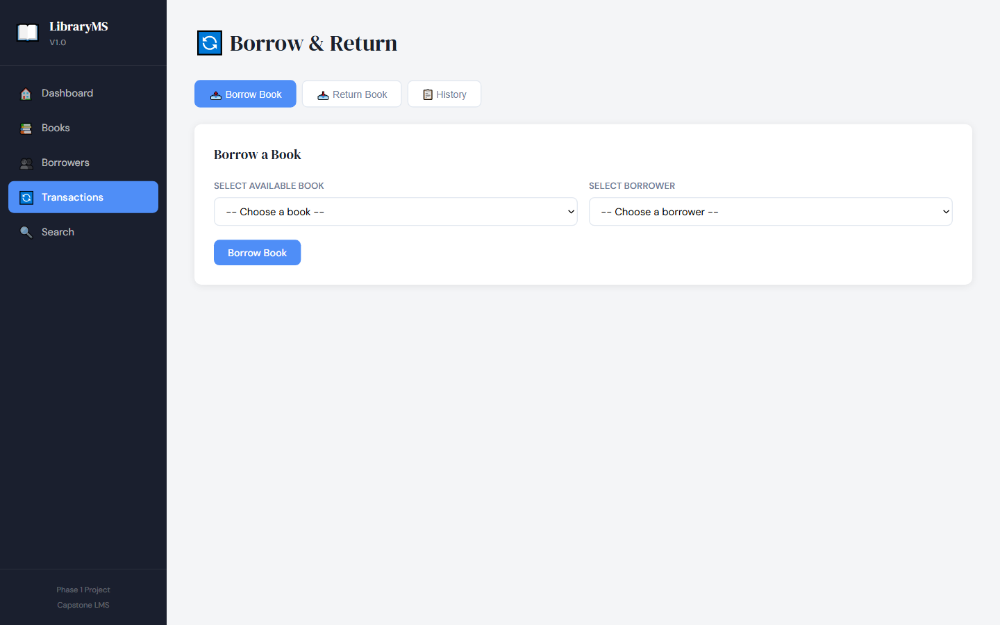

---

### Transactions — Return Book
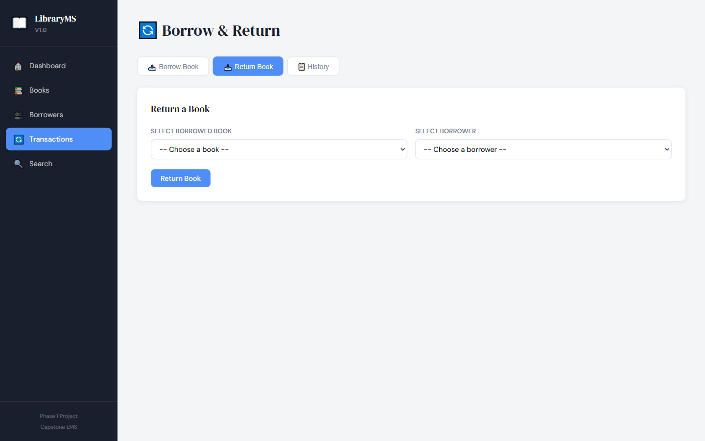

---

### Transactions — History
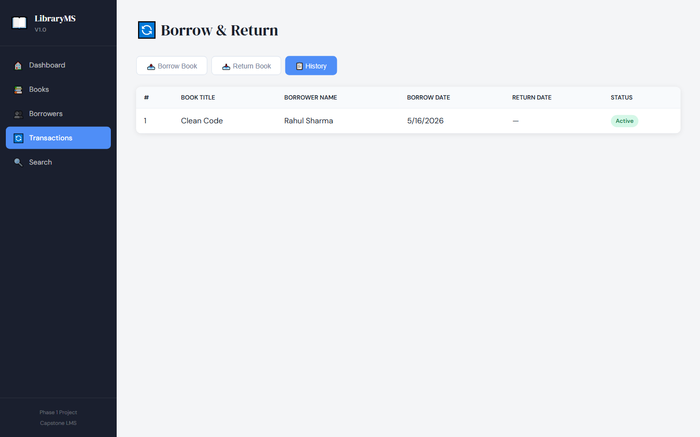

---

### Search Page
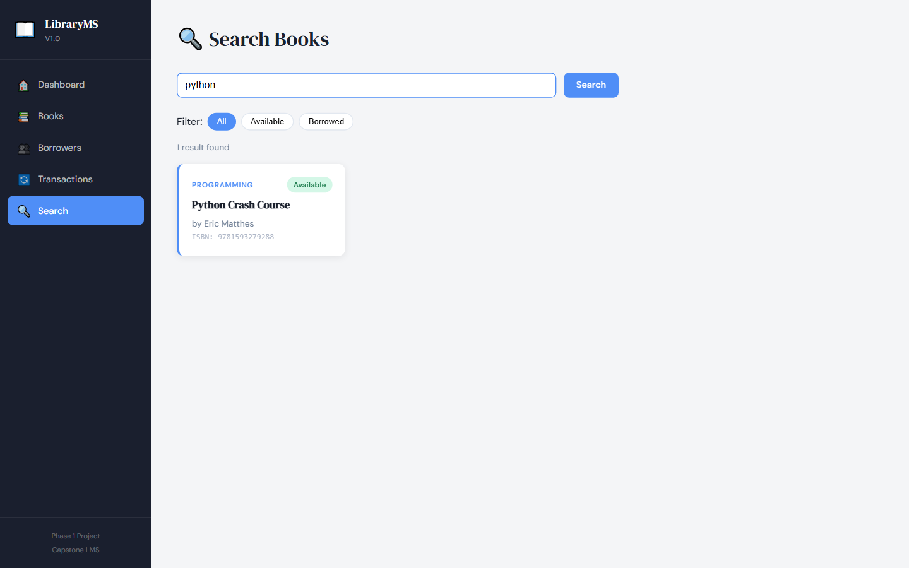

---

### API Testing — Swagger UI (All Endpoints)
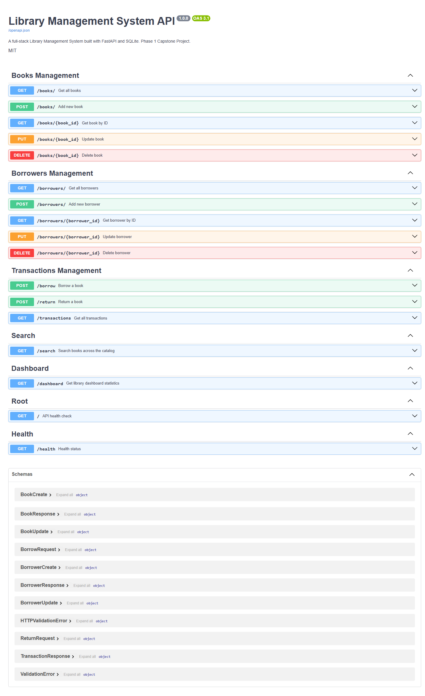

---

### API Testing — GET /books/ Endpoint
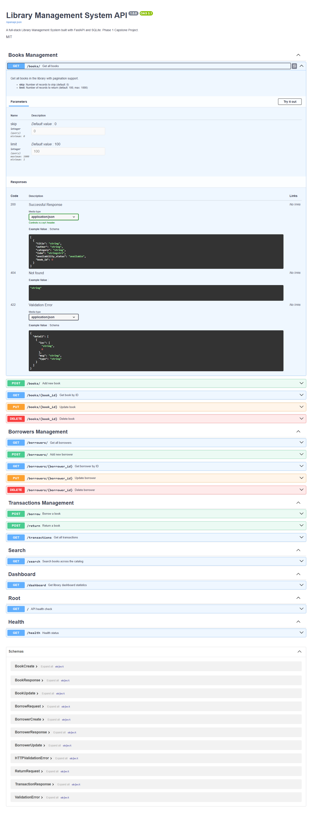

---

### API Testing — GET /dashboard Response
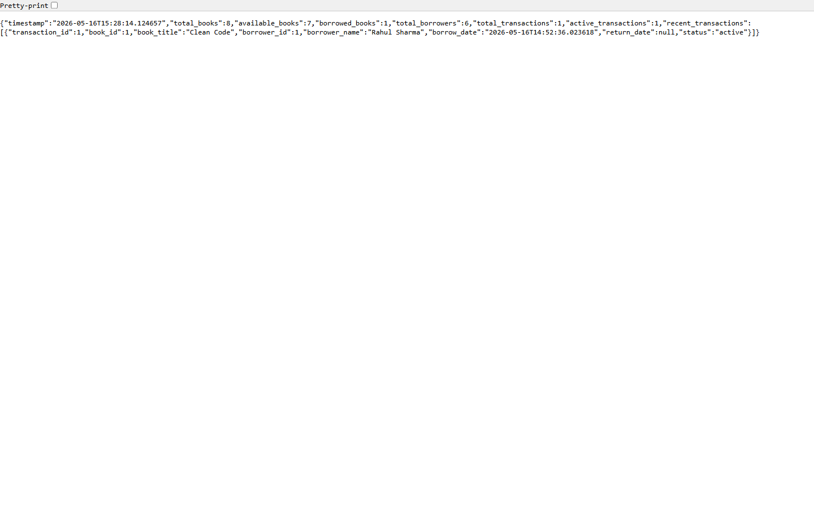

---

### API Testing — GET /health Response


---

### Phase 2 — Analytics Dashboard (Overview)


---

### Phase 2 — Top 10 Most Borrowed Books (Bar Chart)


---

### Phase 2 — Category-wise Borrowing Distribution (Pie Chart)


---

### Phase 2 — Monthly Borrowing Trends (Line Chart)
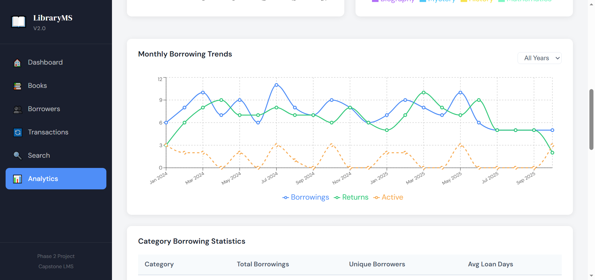

---

### Phase 2 — Overdue Transactions Table
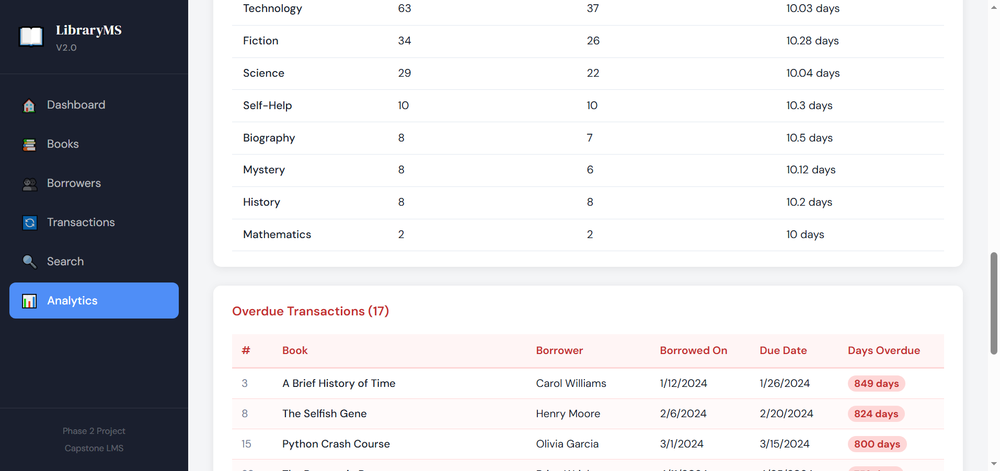

---

### Phase 2 — ETL Pipeline Execution Output
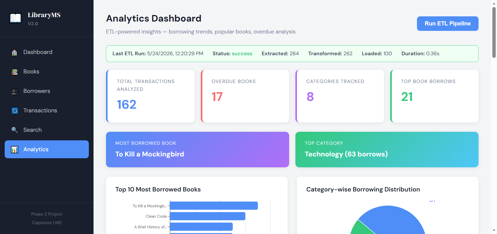

---

## Troubleshooting

**Backend port already in use**
```powershell
# Windows PowerShell — find and stop the process on port 8000
Get-Process -Id (Get-NetTCPConnection -LocalPort 8000).OwningProcess | Stop-Process
```

**Frontend cannot connect to API**
- Confirm backend is running at `http://localhost:8000`
- Check browser console (F12) for CORS errors
- Clear browser cache: `Ctrl + Shift + Delete`

**Database issues**
```bash
rm backend/library.db   # Delete the file
# Restart backend — auto-recreated on startup
```

---

## License

MIT License — Phase 2 Capstone Project  
Version: 2.0.0
